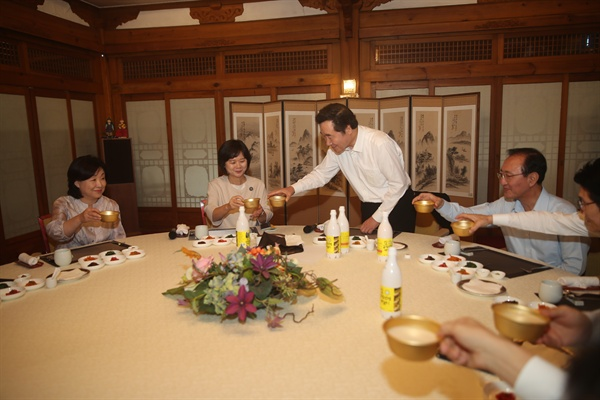

|분자식|발효종류|
|---|---|
|C~6~H~12~O~6~ → 2C~2~H~5~OH + 2CO~2~ + 58kcal |알코올발효|
|C~6~H~12~O~6~ → 2CH~3~CHO + CH~3~COOH + 27.4kcal |초산발효|

증자 蒸煮
http://cafe.daum.net/_c21_/bbs_search_read?grpid=1LiVn&fldid=Txzu&datanum=40

http://blog.naver.com/PostView.nhn?blogId=coscos1221&logNo=110188651939&parentCategoryNo=&categoryNo=84&viewDate=&isShowPopularPosts=true&from=search

식품과학기술대사전

국
[ 麴 , guk ]

외국어 표기
koji(일본어 로마자표기)
증자한 전분질 원료에 순수배양 한 균을 접종하여 번식시킨 것. 
곡(麯)과 국(麴)을 구별하는 경우도 있는데 일본의 입장에서 보면 국(麴)은 살균한 전분질 원료에 순수배양한 균을 접종한 것을 말하며 여기에 대하여 한국에서는 누룩을 곡(麯)으로 표현하여 미생물이 자연배양된 경우를 말한다. 즉, 전자는 입국, 콩고오지, 보리고오지(Koji)이며, 후자는 누룩, 재래식 메주와 같은 것이다. 국에는 50종류 이상의 효소가 있다고 하며 그 주된 기능은 원료미 중의 전분을 분해하여 당분을 만들며, 단백질을 분해하여 아미노산을 만든다. 효모는 이들을 영양원으로 하여 증식하면서 당분으로부터 알코올, 아미노산을 만들고 지방(포화지방산)으로부터 향기성분을 생성한다. 국이 고체입자로 되어있는 것이 병행복발효(竝行復醱酵)에 적합하다.
[네이버 지식백과] 국 [麴, guk] (식품과학기술대사전, 2008. 4. 10., 한국식품과학회)

C~10~H~16~N~5~O~13~P~3~

```javascript
var s = "JavaScript syntax highlighting";
alert(s);
```
 
```python
s = "Python syntax highlighting"
print s
```
 
```
No language indicated, so no syntax highlighting. 
But let's throw in a <b>tag</b>.
```

<dl>
  <dt>Definition list</dt>
  <dd>Is something people use sometimes.</dd>

  <dt>Markdown in HTML</dt>
  <dd>Does *not* work **very** well. Use HTML <em>tags</em>.</dd>
</dl>

#### 막걸리를 가장 잘 사용하는 사람

> "첫째, 막걸리는 배가 불러 안주를 많이 먹을 수 없습니다. 그러니 건강에 좋습니다. 
> 둘째, 어지간해서는 막걸리로 원샷을 외치는 사람은 없습니다. 그러니 천천히 나눠 마시며 마주 앉은 사람과 도란도란 담소할 수 있어 정을 쌓기에 좋습니다. 
> 셋째, 주머니 사정에 좋습니다. 막걸리값이 싼 까닭도 있지만 그보다 더 큰 이유는 배가 불러 웬만해서는 2차를 갈 수 없기 때문입니다. 
> 넷째, 2차를 안 가니 술 마시고도 집에 일찍 들어갑니다. 심야 귀가를 하지 않으니 가족 관계 등 삶에 문제가 없고 다음날 일에도 지장이 없습니다."

그의 막걸리 예찬론이다. '수신제가치국평천하'라는 말이 있는데, 이게 꼭 순서대로 되는 것은 아니지만 그는 적어도 술에 있어서 수신제가를 이룬 셈이다. 그가 막걸리를 내면 아흔아홉 명은 막걸리를 마시지만, 한 명은 소주를 찾는다고 한다. 그 한 명은 그보다 더 기가 센 사람이거나, 그와 아주 친한 사람일 것이다. 친구들끼리 다섯 명만 모여도 소주나 맥주를 마시자면 아무런 저항이 없는데, 막걸리를 마시자 하면 마다는 이들이 생긴다.